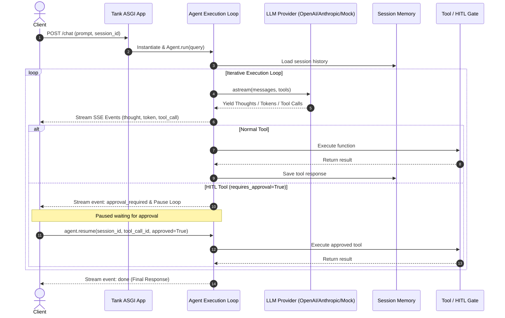

# 🛡️ Tank — AI-Native Web Framework

**Tank** is a batteries-included Python web framework built on Starlette and Pydantic for building, serving, and streaming LLM Agents with tool execution, memory persistence, structured output validation, RAG primitives, and Human-in-the-Loop approval gates.

---

## ✨ Key Features

- ⚡ **Starlette-Powered ASGI Engine**: Stream structured events via Server-Sent Events (SSE) out of the box with zero boilerplate.
- 🛠️ **Dynamic Tool Calling**: Define tools using clean `@tool` decorators with automatic Google/Sphinx docstring parameter parsing and runtime Pydantic schema validation.
- 🎯 **Structured Output Enforcement (`response_model`)**: Validate agent final answers against Pydantic models with automatic self-correction loops on schema mismatches.
- 🛡️ **Human-in-the-Loop (HITL) Approval Gates**: Mark sensitive tools with `@tool(requires_approval=True)` to pause execution mid-turn, stream an `approval_required` SSE event, and seamlessly resume via `agent.resume()`.
- 🧠 **Tiered Memory System**: Built-in `SimpleMemory` (in-memory), `SQLAlchemyMemory` (SQLite/PostgreSQL persistence), and `TokenBufferMemory` (sliding context window token limits).
- 🔍 **RAG Primitives**: Built-in embeddings (`MockEmbeddings`, `OpenAIEmbeddings`), vector stores (`SimpleVectorStore`), and `Retriever` tools.
- 📊 **Built-in Observability & Dashboard**: Track run latency, token counts, step counts, and active sessions visually via `/tank-admin`.
- 🚀 **CLI Scaffolding**: `tank startproject`, `tank startagent`, and `tank runserver` with dev hot-reloading.

---

## 🏗️ Architecture Flow



---

## 📦 Installation

```bash
pip install tank-ai
```

Or install locally in editable mode:
```bash
git clone https://github.com/yasirusman85/Tank.git
cd Tank
pip install -e .
```

---

## 🚀 Quickstart

### 1. Scaffold a New Project
```bash
tank startproject my_ai_app
cd my_ai_app
tank startagent research_bot
```

### 2. Define your Agent & Server
`app.py`:
```python
import uvicorn
from pydantic import BaseModel, Field
from tank import Tank, Agent, LLM, tool

app = Tank()

class UserProfile(BaseModel):
    name: str
    age: int = Field(description="Age in years")
    interests: list[str]

@tool(requires_approval=True)
def delete_user_account(user_id: str) -> str:
    """Deletes a user account from the database. Requires approval."""
    return f"User account {user_id} deleted successfully."

@app.agent_route("/profile")
class ProfileAgent(Agent):
    llm = LLM(provider="mock")
    tools = [delete_user_account]
    response_model = UserProfile

@app.route("/")
async def homepage(request):
    from starlette.responses import JSONResponse
    return JSONResponse({"status": "active", "framework": "Tank"})

if __name__ == "__main__":
    uvicorn.run("app:app", host="127.0.0.1", port=8000, reload=True)
```

### 3. Run the Development Server
```bash
tank runserver
```

---

## 📊 Observability & Telemetry

Tank automatically traces execution runs. Open your browser and navigate to:
```
http://localhost:8000/tank-admin
```
To view live metrics on request latency, total steps, active sessions, and detailed run traces.

---

## 🧪 Running Tests

```bash
pytest tests/
```

---

## 📜 License

This project is licensed under the [MIT License](LICENSE).
